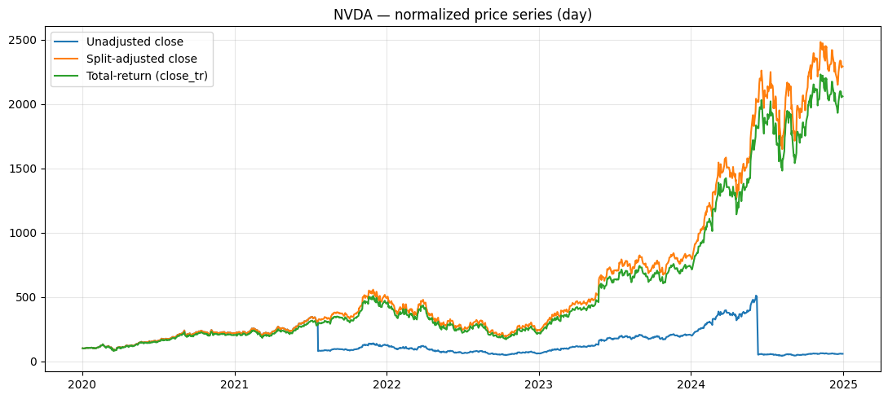

# Polygon.io Data Lake Builder

A pipeline to turn **Polygon.io flat files** into a local **Parquet lake**, pull **refdata** (splits/dividends/security master), and build **adjusted** lakes (split-adjusted + total-return). Scripts are reproducible and notebook-friendly.

<p align="center">

</p>

---

## Features

- Reproducible **unadjusted** lakes (minute/day).
- **Refdata** pullers (security master, splits, dividends).
- **Adjusted** lakes (split-adjusted OHLC/VWAP/Volume + total-return).
- Helper scripts to build **ticker lists** (SPX, NDX, combined) or extract from flatfiles.
- A schema-safe loader module for notebooks/QA plots.

> **Pipeline steps**
>
> 1) Download Polygon flat files  
> 2) Download/build ticker lists  
> 3) Build unadjusted Parquet lakes (**needs ticker lists**)  
> 4) Pull refdata from Polygon (**needs ticker lists**)  
> 5) Build adjusted Parquet lakes from unadjusted + refdata (**needs ticker lists**)

---

## Requirements

- Python 3.10+ (tested on 3.12)
- `pandas`, `pyarrow`, `tqdm`, `typer`, `polygon` (Polygon API client)

Install in editable mode:

```bash
python -m venv .venv && source .venv/bin/activate
pip install -U pip
pip install -e .
```

Set your API key (used in Step 4):

- Add a repo-level `.env`:
  ```ini
  POLYGON_API_KEY=your_key_here
  ```
  or export manually:
  ```bash
  export POLYGON_API_KEY=your_key_here
  ```

---

## Repository Layout

```
repo_polygonio/
├─ pyproject.toml
├─ .env                                  # optional: POLYGON_API_KEY, etc.
├─ src/
│  ├─ polygon_ingest/
│  │  ├─ __init__.py
│  │  ├─ ingest.py                       # CSV.GZ → Parquet lake (minute/day)
│  │  ├─ cli.py                          # `poly` CLI entry (ingestion)
│  │  └─ lake_io.py                      # schema-safe readers for notebooks/QA
│  └─ polygon_pullers/
│     └─ __init__.py                     # refdata pullers (SM/splits/dividends)
├─ legacy_scripts/
│  ├─ polygon_ingest_day.py              # thin shim → run_ingest(tf="day")
│  ├─ polygon_ingest_minute.py           # thin shim → run_ingest(tf="minute")
│  ├─ run_pullers.py                     # orchestrates refdata pulls
│  ├─ factor_builder.py                  # builds adjusted lakes from unadj + refdata
│  └─ polygon_lake_loader.py             # optional CLI shim using lake_io
├─ scripts/
│  ├─ build_adjusted_lake.sh             # unified builder (minute/day)
│  ├─ pull_ref_data.sh                   # wrapper to run `run_pullers.py` (loads .env)
│  ├─ build_index_universes.py           # build SPX/NDX/combined ticker lists
│  └─ extract_tickers_from_flatfiles.py  # discover tickers from CSV.GZ flatfiles
├─ data/
│  └─ ticker_lists/                      # generated universe lists (*.json / *.txt)
├─ refdata/
│  └─ spx_ndx_combined/                  # generated by pullers (SM/splits/divs)
├─ lake/                                 # unadjusted lakes (generated)
│  ├─ minute/<TICKER>/<YYYY>/<MM>/<DD>.parquet
│  └─ day/<TICKER>/<YYYY>/<MM>.parquet
├─ lake_adj/                             # adjusted lakes (generated)
│  ├─ minute/<TICKER>/<YYYY>/<MM>/<DD>.parquet
│  └─ day/<TICKER>/<YYYY>/<MM>.parquet
└─ notebooks/
   └─ 03_load_data_inspect_adjustment.ipynb  # QA: unadj vs split-adj vs TR
```

---

## Quickstart

### Step 1 — Download Polygon flat files

Download Polygon CSV.GZ drops and place them somewhere on disk, e.g.:

```bash
$HOME/data/polygonio_data/flatfiles/
```

> Tip: keep minute and day in separate subfolders if you have both.

---

### Step 2 — Build ticker lists

**Option A — Build SPX/NDX/Combined from Wikipedia**
```bash
python scripts/build_index_universes.py --outdir data/ticker_lists
# writes: data/ticker_lists/{spx,ndx,spx_ndx_combined}.{json,txt}
```

**Option B — Extract tickers from your flatfiles**
```bash
python scripts/extract_tickers_from_flatfiles.py \
  --src $HOME/data/polygonio_data/flatfiles \
  --outdir data/ticker_lists \
  --name all_polygonio_tickers
# writes: data/ticker_lists/all_polygonio_tickers.{json,txt}
```

---

### Step 3 — Create the **unadjusted** Parquet lakes (needs ticker lists)

Use the `poly` CLI (installed with this package) or the legacy shims.

**Using `poly` (example):**
```bash
# Day (unadjusted)
poly bars \
  --tf day \
  --src  $HOME/data/polygonio_data/flatfiles/day \
  --dst  ./lake/day \
  --tickers data/ticker_lists/spx_ndx_combined.json

# Minute (unadjusted)
poly bars \
  --tf minute \
  --src  $HOME/data/polygonio_data/flatfiles/minute \
  --dst  ./lake/minute \
  --tickers data/ticker_lists/spx_ndx_combined.json
```

**Using legacy shims (alternative):**
```bash
python legacy_scripts/polygon_ingest_day.py \
  --src $HOME/data/polygonio_data/flatfiles/day \
  --dst ./lake/day \
  --tickers data/ticker_lists/spx_ndx_combined.json

python legacy_scripts/polygon_ingest_minute.py \
  --src $HOME/data/polygonio_data/flatfiles/minute \
  --dst ./lake/minute \
  --tickers data/ticker_lists/spx_ndx_combined.json
```

Output layout:
- `lake/day/<TICKER>/<YYYY>/<MM>.parquet`
- `lake/minute/<TICKER>/<YYYY>/<MM>/<DD>.parquet`

---

### Step 4 — Pull **refdata** from Polygon (needs ticker lists)

Make sure `POLYGON_API_KEY` is set (via `.env` or env var) and run:

```bash
bash scripts/pull_ref_data.sh
```

By default, this writes into `refdata/spx_ndx_combined/`:
- `security_master.parquet`
- `stock_splits.parquet`
- `cash_dividends.parquet`
- `_ticker_normalization_map.csv` / `_missing_tickers.txt` (preflight)

> Adjust `scripts/pull_ref_data.sh` if you use a different collection/path.

---

### Step 5 — Build the **adjusted** lakes (needs ticker lists)

Use the unified builder:

```bash
# Day — write all split-adjusted columns + close_tr
scripts/build_adjusted_lake.sh -t day -c spx_ndx_combined -m ohlc

# Minute — narrow to a window if desired
scripts/build_adjusted_lake.sh -t minute -c spx_ndx_combined -m ohlc \
  -s 2023-01-01 -e 2023-12-31
```

Defaults (override with flags):
- Unadjusted input: `~/data/polygonio_data/parquet_lake/<tf>_aggs_v1/<collection>`
- Adjusted output: `~/data/polygonio_data/parquet_lake/<tf>_aggs_v1/<collection>_adjusted`
- Refdata: `refdata/<collection>/`

`-m` (`--materialize`) options:
- `minimal` → only what’s needed (e.g., `close_tr`)
- `close` → adds `close_sa`
- `ohlc` → adds all `*_sa` (`open_sa`, `high_sa`, `low_sa`, `close_sa`, `vwap_sa`, `volume_sa`) + `close_tr` **(recommended)**

Adjusted output mirrors unadjusted:
- `lake_adj/day/<TICKER>/<YYYY>/<MM>.parquet`
- `lake_adj/minute/<TICKER>/<YYYY>/<MM>/<DD>.parquet`

---

## Notebook / QA

Use `notebooks/03_load_data_inspect_adjustment.ipynb` to load and plot:
- **Unadjusted `close`**
- **Split-adjusted `close_sa`**
- **Total-return `close_tr`**

The loader (`polygon_ingest.lake_io`) is schema-safe:
- Accepts `datetime` or `date/timestamp`.
- For **day** data, merges on **calendar date** (not exact time).
- Maps `*_split → *_sa` if adjusted files use that naming.

---

## Troubleshooting

- **`POLYGON_API_KEY` not found**  
  Put it in `.env` (repo root) or export it in your shell. `scripts/pull_ref_data.sh` auto-loads `.env`.

- **Empty plots / empty merges**  
  Double-check notebook paths match your lakes. For **day**, both lakes must overlap on dates.

- **Missing `close_sa` in adjusted files**  
  Build with `-m ohlc`. The loader also maps `close_split → close_sa` when present.

- **Mixed schemas across years**  
  `lake_io` inspects each Parquet file’s schema and only reads columns that exist.

---

## Notes & Conventions

- **Time zone:** all timestamps in UTC; day joins occur on **calendar date** (UTC).
- **Total return (`close_tr`)**: built over split-adjusted prices, reinvesting cash dividends on ex-date.
- **QA plot normalization:** base-100 (first value → 100) to compare paths. Shapes are unchanged.
