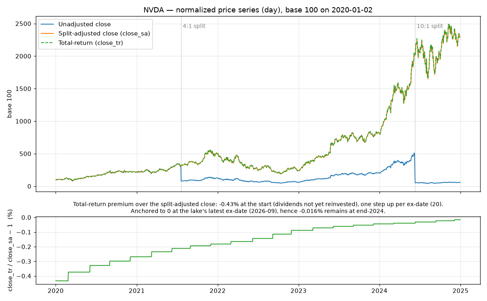

# Polygon.io Data Lake Builder

A pipeline that turns **Polygon.io flat files** into local **Parquet lakes** (per-ticker or whole-market layouts), pulls **reference data** for the entire market in a few hundred requests (tickers with FIGI/CIK, splits, dividends), keys every row by the **company** behind a ticker so recycled symbols adjust correctly, builds **adjusted** lakes (split-adjusted + total-return), and derives a **survivorship-free, point-in-time universe**. 131 regression tests, several of them known-answer checks against real data.

<p align="center">

</p>

<p align="center"><sub>NVDA 2020–2024 day bars from the Polygon flat files; splits and dividends pulled with Step 4; adjusted with Step 5 (<code>-m ohlc</code>); rendered through <code>polygon_ingest.lake_io.load_series</code>. The lower panel is the total-return premium over the split-adjusted close: for a stock yielding ~0.1%/yr it must sit within a fraction of a percent of zero and step up only at ex-dates.</sub></p>

---

## Features

- **Unadjusted** lakes (minute/day) partitioned on the ET trading date, in a per-ticker or a whole-market (`--layout market`) layout, with bounded memory. Symbols are stored as Polygon spells them, because the letter case *is* the share class (`AAp` is Alcoa's preferred, not `AAP`).
- **Refdata** in a few hundred requests for any universe size: market-wide tickers (active + delisted), splits and dividends tables, refreshed incrementally; collection files derived by filtering. **Holder ids** (FIGI → CIK → ticker) keep a recycled ticker's previous company separate.
- **Adjusted** lakes (split-adjusted OHLC/volume, VWAP when the source carries it, + total-return) in either layout: a batch path for day lakes, a streaming path for minute lakes.
- Helper scripts to build **ticker lists** (SPX, NDX, combined) or extract from flatfiles, and a **point-in-time universe** builder (membership per rebalance date from trailing dollar volume; survivorship-free).
- Schema- and layout-aware loaders (`polygon_ingest.lake_io`) for notebooks and research joins.

> **Two workflows**
>
> **A. Collection (from a ticker list):** 1) flat files → 2) ticker list (Step 2, A or B) → 3) `poly bars --watch …` → 4) `pull_ref_data.sh` (market tables, derived for the list) → 5) `build_adjusted_lake.sh`. Output: `lake_adj/<tf>/<collection>_adjusted/<TICKER>/…`.
>
> **B. Whole universe (research):** 1) flat files → 3) `poly bars --layout market` (no ticker list: one file per period holding every ticker) → 4) `pull_ref_data.sh` (the same market tables) → 5) `factor_builder.py` over every ticker (layout detected) → 2) `build_pit_universe.py` for point-in-time membership → **join membership (date, ticker) against the adjusted lake at research time** (see *Research usage*). Nothing in B needs a ticker list.

---

## Requirements

- Python 3.10+ (tested on 3.12)
- Runtime: `pandas`, `pyarrow`, `numpy`, `tqdm`, `typer`, `polygon-api-client` (all installed by `pip install -e .`)
- Extras: `[dev]` → `pytest`; `[notebooks]` → `matplotlib`, `ipykernel`, `jupyterlab`, `lxml` (QA notebooks and the Wikipedia ticker-list script)

Install in editable mode (venv):

```bash
python -m venv .venv && source .venv/bin/activate
pip install -U pip
pip install -e ".[dev,notebooks]"
```

or with conda (`environment.yml` provides the interpreter and installs the same extras):

```bash
conda env create -f environment.yml && conda activate poly_ingest
```

Run the regression tests (adjustment math, holder ids, layouts, pullers, universe):

```bash
pytest
```

Set your API key (used in Step 4):

- Add a repo-level `.env`:
  ```ini
  POLYGON_API_KEY=your_key_here
  ```
  or export manually:
  ```bash
  export POLYGON_API_KEY=your_key_here
  ```

---

## Repository Layout

```
repo_polygonio/
├─ pyproject.toml
├─ .gitignore                            # ignores .env, lakes, refdata, caches
├─ .env                                  # optional: POLYGON_API_KEY, etc. (git-ignored)
├─ src/
│  ├─ polygon_ingest/
│  │  ├─ __init__.py
│  │  ├─ ingest.py                       # CSV.GZ → Parquet lake (minute/day)
│  │  ├─ cli.py                          # `poly bars` CLI entry (ingestion)
│  │  ├─ lake_io.py                      # schema-safe readers for notebooks/QA
│  │  ├─ tickers.py                      # ticker spelling: the case is the share class; matching rules
│  │  └─ universe.py                     # point-in-time universe: segments, eligibility, membership
│  │ 
│  └─ polygon_pullers/
│     ├─ __init__.py                     # per-ticker pullers (details/events/splits/dividends), holder ids
│     └─ bulk.py                         # market-wide tables + derived collection files (default)
│
├─ legacy_scripts/
│  ├─ polygon_ingest_day.py              # thin shim → run_ingest(tf="day")
│  ├─ polygon_ingest_minute.py           # thin shim → run_ingest(tf="minute")
│  ├─ run_pullers.py                     # orchestrates refdata pulls
│  ├─ factor_builder.py                  # builds adjusted lakes from unadj + refdata
│  └─ polygon_lake_loader.py             # optional CLI shim using lake_io
│
├─ scripts/
│  ├─ build_pit_universe.py              # point-in-time universe (membership per rebalance date)
│  ├─ build_adjusted_lake.sh             # unified builder (minute/day)
│  ├─ pull_ref_data.sh                   # wrapper to run `run_pullers.py` (loads .env)
│  ├─ build_index_universes.py           # build SPX/NDX/combined ticker lists
│  └─ extract_tickers_from_flatfiles.py  # discover tickers from CSV.GZ flatfiles
│
├─ data/
│  ├─ ticker_lists/                      # static ticker lists (*.json / *.txt)
│  └─ universes/<name>/                  # point-in-time membership, segments, summary (generated, git-ignored)
│
├─ refdata/
│  ├─ _market/                           # market-wide tickers / splits / dividends (generated, shared)
│  ├─ spx_ndx_combined/                  # derived for a collection (security master / splits / dividends)
│  └─ all/                               # derived for every ticker in the lake (whole-universe workflow)
│
├─ lake/                                 # unadjusted lakes (generated, git-ignored)
│  ├─ minute/<collection>/<TICKER>/<YYYY>/<MM>/<DD>.parquet
│  ├─ day/<collection>/<TICKER>/<YYYY>/<MM>.parquet
│  ├─ day/all/<YYYY>/<MM>.parquet         # --layout market: every ticker, one file per month
│  └─ minute/all/<YYYY>/<MM>/<DD>.parquet # --layout market: every ticker, one file per day (+ <DD>.idx.parquet)
│
├─ lake_adj/                             # adjusted lakes (generated, git-ignored; layout mirrors the input)
│  ├─ minute/<collection>_adjusted/<TICKER>/<YYYY>/<MM>/<DD>.parquet
│  ├─ day/<collection>_adjusted/<TICKER>/<YYYY>/<MM>.parquet
│  ├─ day/all_adjusted/<YYYY>/<MM>.parquet          # market layout, every ticker, holder `id` per row
│  └─ minute/all_adjusted/<YYYY>/<MM>/<DD>.parquet  # market layout (+ <DD>.idx.parquet)
│
├─ notebooks/                            # all executed against the real lakes, outputs committed
│  ├─ 01_index_universes.ipynb           # today's SPX/NDX lists (survivorship biased — see 05)
│  ├─ 02_extract_tickers.ipynb           # every symbol in the flat files, case preserved
│  ├─ 03_load_data_inspect_adjustment.ipynb  # QA: unadj vs split-adj vs TR, with assertions
│  ├─ 04_lake_inventory_and_quality.ipynb    # EDA: coverage, calendar, data-quality findings
│  ├─ 05_universe_and_survivorship.ipynb     # EDA: point-in-time universe, survivorship priced
│  └─ 06_minute_lake_access.ipynb            # EDA: reading 7 bn rows, sidecars, intraday profile
├─ tests/                                # pytest, 131 tests: adjustment math, holder ids, ticker case, layouts, pullers, universe
└─ figures/adjust.png                    # README QA figure, built from real refdata
```

---

## Quickstart

### Step 1 — Download Polygon flat files

Download Polygon CSV.GZ drops and place them somewhere on disk, e.g.:

```bash
$HOME/data/polygonio_data/flatfiles/
```

> Tip: keep minute and day in separate subfolders if you have both.

---

### Step 2 — Build ticker lists

**Option A — Build SPX/NDX/Combined from Wikipedia** (today's constituents — survivorship-biased when applied to history; see Option C)
```bash
python scripts/build_index_universes.py --outdir data/ticker_lists
# writes: data/ticker_lists/{spx,ndx,spx_ndx_combined}.{json,txt}
```

**Option B — Extract tickers from your flatfiles**
```bash
python scripts/extract_tickers_from_flatfiles.py \
  --src $HOME/data/polygonio_data/flatfiles \
  --outdir data/ticker_lists \
  --name all_polygonio_tickers
# writes: data/ticker_lists/all_polygonio_tickers.{json,txt}
```

**Option C — Point-in-time universe (use this for research).** Options A and B are *static* lists. Today's S&P 500 applied back to 2003 contains only the companies that survived and grew into the index — the textbook look-ahead / survivorship bias — while the flat files themselves are survivorship-free (Lehman, Bear Stearns, Washington Mutual, the old GM are all in them). Build membership **per rebalance date from data available on that date** instead:

```bash
# needs the whole-universe day lake (Step 3, --layout market) and the market tickers table (Step 4)
python scripts/build_pit_universe.py \
  --lake ./lake/day/all \
  --market-tickers refdata/_market/market_tickers.parquet \
  --out data/universes/top1000_cs_monthly \
  --top-n 1000 --min-price 1 --exclude-tickers QQQ,VXX --emit-watchlist \
  --static-list data/ticker_lists/spx_ndx_combined.json     # optional: quantify what the static list misses
```

Each month-end, eligible common stocks are ranked by trailing 63-day dollar volume and the top N are members; a ticker must have traded within the last 5 days and have ≥ 40 observations in the window (fresh listings excluded). Recycled symbols are handled by splitting a ticker's history at trading gaps of ≥ 60 days (exchange-listed names print daily; Bear Stearns → an ETN under `BSC` took 69 days): the tickers table describes the *current* holder, so its type applies to the last segment only, and earlier segments are admitted unless the symbol looks like a derivative (`--untyped-policy`). That recovers Bear Stearns, Meta under `FB`, Wachovia, Sun, DirecTV — and also a fund that came back to its own symbol (QQQ 2003–04, VXX), which no table field can tell apart; `summary.json` lists the admitted untyped segments for review and `--exclude-tickers QQQ,VXX` removes them by hand. Outputs: `membership.parquet` (rebalance_date, ticker, rank, adv_usd, …), `segments.parquet`, `summary.json` (members per year, share of members that are no longer an active common stock today, share missing from the static list) and, with `--emit-watchlist`, `watchlist.json` — the union of all members, usable as `--watch` for a minute ingest. Use `polygon_ingest.universe.expand_daily()` to get the membership on every trading day. The universe is a **membership table you join at research time**, not an ingest filter: build the adjusted lake for the whole `day/all` lake (bulk refdata covers every ticker) and filter by (date, ticker) afterwards. Live result on 2003–2025: 262 rebalances, 4,171 distinct members; 55 % of the 2003 members are no longer an active common stock today.

---

### Step 3 — Create the **unadjusted** Parquet lakes (ticker list for a collection; none for the whole universe)

Use the `poly` CLI (installed with this package) or the legacy shims.

**Using `poly` (example):**
```bash
# Day (unadjusted)
poly bars \
  --tf    day \
  --src   $HOME/data/polygonio_data/flatfiles/day \
  --out   ./lake/day/spx_ndx_combined \
  --watch data/ticker_lists/spx_ndx_combined.json

# Minute (unadjusted)
poly bars \
  --tf    minute \
  --src   $HOME/data/polygonio_data/flatfiles/minute \
  --out   ./lake/minute/spx_ndx_combined \
  --watch data/ticker_lists/spx_ndx_combined.json
```

**Using legacy shims (alternative):**
```bash
python legacy_scripts/polygon_ingest_day.py \
  --src   $HOME/data/polygonio_data/flatfiles/day \
  --out   ./lake/day/spx_ndx_combined \
  --watch data/ticker_lists/spx_ndx_combined.json

python legacy_scripts/polygon_ingest_minute.py \
  --src   $HOME/data/polygonio_data/flatfiles/minute \
  --out   ./lake/minute/spx_ndx_combined \
  --watch data/ticker_lists/spx_ndx_combined.json
```

Output layout (`<collection>` is the ticker-list name, e.g. `spx_ndx_combined`):
- `lake/day/<collection>/<TICKER>/<YYYY>/<MM>.parquet`
- `lake/minute/<collection>/<TICKER>/<YYYY>/<MM>/<DD>.parquet`

Flags: `--out` is the destination lake root, `--watch` is the ticker list (json/txt). Use `--only NVDA` for a single ticker and `--write-manifest` to emit a manifest the loader can use.

**Whole universe (every ticker in the flat files): use the market layout.** One file per ticker per month means ~2.4 million tiny files for the full market; `--layout market` writes one file per period holding all tickers instead — 264 monthly files for the day history, ticker-major with row-group statistics so a single symbol is pruned on read:

```bash
poly bars --tf day --layout market \
  --src $HOME/data/polygonio_data/flatfiles/day \
  --out ./lake/day/all          # -> lake/day/all/<YYYY>/<MM>.parquet, no --watch
```

The loaders and Step 5 detect the layout from the directory structure (`<YYYY>/` vs `<TICKER>/`), so nothing downstream needs a flag. Workers write each period's files as soon as it can no longer receive rows, so memory stays at about two periods per worker for either layout.

**Whole-universe minute lake.** `poly bars --tf minute --layout market` writes one file per trading day holding every ticker (`lake/minute/all/<YYYY>/<MM>/<DD>.parquet`, ticker-major, 128k-row row groups) plus a `<DD>.idx.parquet` sidecar (per ticker: first/last close, row count, row positions). That is 5,517 files for the full history instead of ~50 million per-ticker-day files. The streaming adjuster (Step 5, `-t minute`, layout auto-detected) reads each day file once, joins that day's split/dividend factors and holder ids by ticker, and writes the same layout; the sidecars make its day-edge scan instant, and readers use them to skip days a symbol is absent from. A one-day file is ~1.4 M rows (2024); expect roughly 150–200 GB for the full market.

---

### Step 4 — Pull **refdata** from Polygon (market-wide; a ticker list only selects what gets derived)

Make sure `POLYGON_API_KEY` is set (via `.env` or env var) and run:

```bash
bash scripts/pull_ref_data.sh
```

This pulls **market-wide** reference tables once — a few hundred requests in total, the same for 3 tickers or 10,000 — into `refdata/_market/`, then **derives** the collection's files by filtering to your ticker list:

| `refdata/_market/` (shared) | `refdata/<collection>/` (derived) |
|---|---|
| `market_tickers.parquet` — every active **and delisted** stock: FIGI, CIK, delisting date, `holder_id` | `security_master.parquet` — one row per **(ticker, holder)** |
| `market_splits.parquet` — every split, with Polygon's row `id` | `stock_splits.parquet` |
| `market_dividends.parquet` — every cash dividend, with `id` | `cash_dividends.parquet` |
| | `_missing_tickers.txt`, `_ticker_normalization_map.csv` |

Re-running is **incremental**: splits and dividends are fetched from the latest date already held minus 30 days and merged by `id`; the tickers table is refreshed in full. Pass `--full` (via `bash scripts/pull_ref_data.sh --full`) to refetch everything. The same mechanism makes a long pull **resumable**: pages arrive in date order and are checkpointed to the table every 25 pages (and on any error), so if a multi-hour dividends pull dies on a network blip, rerunning `bash scripts/pull_ref_data.sh --tables dividends` continues from where it stopped instead of starting over (`--tables` skips refetching the other tables).

A **holder** is the company behind a ticker, `holder_id` = composite FIGI → `CIK__<cik>` → `NOFIGI__<TICKER>`. A recycled symbol (General Motors Corp until 2009, General Motors Company from 2010-11-18) appears in the tickers table as one active and one delisted record and becomes two holders with a window boundary at the delisting date, so the second company's splits and dividends never touch the first one's prices. If the previous company was *renamed* before delisting, its delisted record is under its final symbol; use probe dates for those:

```bash
POLYGON_PROBE_DATES=2005-01-03,2012-01-03 bash scripts/pull_ref_data.sh   # +1 request per ticker per date
POLYGON_EVENTS=1 bash scripts/pull_ref_data.sh                            # +1 request per ticker: symbol history (FB → META), written to ticker_symbol_history.parquet
POLYGON_PER_TICKER=1 bash scripts/pull_ref_data.sh                        # the older per-ticker pullers (several requests per ticker)
POLYGON_REFDATA_ROOT=/data/parquet_lake/refdata bash scripts/pull_ref_data.sh   # keep refdata next to your lakes
```

Polygon returns no FIGI for some delisted holders, hence the CIK fallback. Point Step 5 at a non-default refdata location with `-r <dir>`.

**Symbols that changed hands without a trace.** A previous holder that left no record under the symbol is invisible to the tickers table: `FB` is now a ProShares ETF (listed 2024) and Polygon keeps no delisted `FB` record for Meta. `POLYGON_EVENTS=1` fixes this: each holder's ticker-change history becomes security-master rows per (holder, symbol) window — `FB` → Meta 2012-05-18..2022-06-08 from META's events — and a **confirmed** adoption date (a real ticker change, not Polygon's 2003-09-10 history start) stops a holder from claiming rows before it took the symbol; those rows fall to an unknown holder (`NOFIGI__FB`) instead of the wrong company. Include both the current and the former symbol in your ticker list to stitch a company across a rename.

---

### Step 5 — Build the **adjusted** lakes

Use the unified builder:

```bash
# Day — write all split-adjusted columns + close_tr
scripts/build_adjusted_lake.sh -t day -c spx_ndx_combined -m ohlc \
  -p ./lake/day/spx_ndx_combined \
  -o ./lake_adj/day/spx_ndx_combined_adjusted

# Minute — narrow to a window if desired
scripts/build_adjusted_lake.sh -t minute -c spx_ndx_combined -m ohlc \
  -p ./lake/minute/spx_ndx_combined \
  -o ./lake_adj/minute/spx_ndx_combined_adjusted \
  -s 2023-01-01 -e 2023-12-31
```

Defaults when `-p` / `-o` are omitted. Note these point at `~/data/...`, **not** at the `./lake` output from Step 3, which is why the examples above pass them explicitly:
- Unadjusted input (`-p`): `~/data/polygonio_data/parquet_lake/<tf>_aggs_v1/<collection>`
- Adjusted output (`-o`): `~/data/polygonio_data/parquet_lake/<tf>_aggs_v1/<collection>_adjusted`
- Refdata: `refdata/<collection>/` (derived from `-c`)
- Workers: `-w` defaults to the machine's core count (day mode: one process per slice of holders)

`-m` (`--materialize`) options:
- `minimal` → only what’s needed (e.g., `close_tr`)
- `close` → adds `close_sa`
- `ohlc` → adds all `*_sa` (`open_sa`, `high_sa`, `low_sa`, `close_sa`, `volume_sa`; `vwap_sa` only when the source has VWAP — Polygon's flat files don't) + `close_tr` **(recommended)**

Adjusted output mirrors the unadjusted layout (and is what the QA notebook expects):
- `lake_adj/day/<collection>_adjusted/<TICKER>/<YYYY>/<MM>.parquet`
- `lake_adj/minute/<collection>_adjusted/<TICKER>/<YYYY>/<MM>/<DD>.parquet`
- market layout: `lake_adj/day/all_adjusted/<YYYY>/<MM>.parquet`, `lake_adj/minute/all_adjusted/<YYYY>/<MM>/<DD>.parquet`

Every adjusted row carries `id`, the holder (company) of the ticker on that date — see *Notes & Conventions*.

**Whole universe (market layout).** The wrapper script keys on a ticker list in `data/ticker_lists/`, so call the builder directly; the layout is detected from the unadjusted lake and mirrored on output:

```bash
# every ticker in the market day lake, then refdata for all of them derived from the market tables (no requests):
python -c "import glob,json,pandas as pd; t=set().union(*(set(pd.read_parquet(f,columns=['ticker']).ticker) for f in glob.glob('lake/day/all/*/*.parquet'))); json.dump(sorted(t),open('data/universes/all_tickers.json','w'))"
python legacy_scripts/run_pullers.py --bulk --tables "" --no-normalize \
  --tickers data/universes/all_tickers.json --outdir refdata/all

python legacy_scripts/factor_builder.py \
  --prices ./lake/day/all --refdir refdata/all \
  --granularity day --outdir ./lake_adj/day/all_adjusted \
  --adjust both --materialize ohlc --workers 12 --write-workers 8
# -> lake_adj/day/all_adjusted/<YYYY>/<MM>.parquet, every ticker, holder `id`s

python legacy_scripts/factor_builder.py \
  --prices ./lake/minute/all --refdir refdata/all \
  --granularity minute --minute-stream --outdir ./lake_adj/minute/all_adjusted \
  --adjust both --materialize ohlc --write-workers 8 --stream-read-workers 8
```

The day **batch** path splits the holders over `--workers` processes; each one reads, adjusts and writes its own slice end to end (a renamed company's tickers always share a slice), so reading and writing scale with cores and each process holds about 1/N of the lake (`--workers 1` is the single-process reference path, ≈ 25 GB for the full market). Minute lakes use the **streaming** path, one day file at a time, with `--write-workers` processes. Flags worth knowing: `-r/--refdir` and `-L/--layout` on the wrapper (`--refdir`, `--layout` on the builder), and `--detect-split-gaps`, which infers a split from an overnight price gap for tickers with no splits row — **off by default**, because on the full market it fires on warrants and penny stocks and the market splits table already holds every real split.

---

## Notebooks

Six notebooks, all executed against the real lakes with their outputs committed, so they read as a
report as well as running as code. They take the lake root from `POLYGON_LAKE_ROOT` (and the flat
files from `POLYGON_FLATFILES`), defaulting to `~/local/parquet_lake`, so nothing hard-codes a path.

| Notebook | What it is for |
|---|---|
| `01_index_universes` | Build today's S&P 500 / Nasdaq-100 lists. Writes to `data/ticker_lists/refreshed/` rather than over the committed lists, and shows a year of index drift. |
| `02_extract_tickers` | Every symbol in the flat files, survivorship free. Explains why ticker case must be preserved and why `NA` needs `keep_default_na=False`. |
| `03_load_data_inspect_adjustment` | QA one symbol: unadjusted vs `close_sa` vs `close_tr`, with five assertions that fail on a wrongly-signed or unanchored total-return factor. |
| `04_lake_inventory_and_quality` | What is in every lake, calendar and bar-level integrity, and the data-quality findings below. |
| `05_universe_and_survivorship` | The point-in-time universe: liquidity bar, turnover, and survivorship bias measured in return terms. |
| `06_minute_lake_access` | How to read 7 billion minute rows: layouts, `.idx.parquet` sidecars, measured read costs, intraday volume profile. |

**Known data issues these surfaced:**

- **Ticker casing — fixed; the lakes were rebuilt.** Polygon encodes share class in letter case
  (`AAp` is Alcoa's $3.75 preferred, a different security from `AAP` common; `AANw` is a warrant, a
  trailing lowercase `p`/`w`/`r` marks a preferred series, warrant or right). `polygon_ingest` used
  to upper-case on ingest, so about 90 symbols carried two securities' bars — 29,258 duplicated
  ticker-days, 0.13% of the day lake — and the adjusted lakes gave those rows the common stock's
  holder id, splits and dividends. Symbols are now stored exactly as Polygon spells them, in the
  lakes and in the reference tables: the day lake went from 33,708 to 33,833 symbols with the same
  46,490,595 rows, and 4,041 symbols carry a lowercase class letter. **Group by the ticker as
  spelled**, never by an upper-cased copy. See *Ticker case* under Notes & Conventions.
- **No corporate actions for preferred and warrant lines.** Polygon's splits and dividends endpoints
  return nothing for the mixed-case symbols (`?ticker=AAp` is empty on both), so those securities come
  out of the adjuster with `close_tr` equal to `close_sa` for their whole history. That reads like a
  working total-return series and is not one. A source gap, not a pipeline one.
- **One mis-stamped source file.** 28 ticker-days on 2019-08-13 still carry two rows: the
  `2019-08-12` flat file holds 29 rows stamped with the next trading day, 28 of whose symbols also
  appear in that day's own file. Both rows are legitimately stamped `2019-08-13 00:00` ET, so no
  ingest rule can separate them. 56 rows of 46.5 million; keep the higher-volume row, as notebook 04
  does.
- **Symbols with no reference row.** 1,853 of the day lake's 33,833 tickers have none — 904 of them
  class lines (preferred series, warrants, rights) the tickers endpoint does not carry, the rest mostly
  exchange test symbols. `ZTEST`, `ZVZZT` and friends quote up to $500,000 and rank first by dollar
  volume in 167 of the universe's 262 months. Exclude them (`--exclude-tickers` on the universe build)
  before any return study.

Notebook 03 loads and plots:
- **Unadjusted `close`**
- **Split-adjusted `close_sa`**
- **Total-return `close_tr`**

The loaders (`polygon_ingest.lake_io`) are schema- and layout-aware:
- Accept `datetime` or `date/timestamp` and read only the columns a file has.
- For **day** data, merge on **calendar date** (not exact time); minute data on the exact timestamp.
- Map `*_split → *_sa` if adjusted files use that naming.
- Detect the ticker vs market layout of each root and push a parquet filter on `ticker` for market files; minute day files' `.idx.parquet` sidecars skip days a symbol is absent from.

**Research usage — join the point-in-time universe with the adjusted market lake**

```python
import pandas as pd
from polygon_ingest.lake_io import load_polygonio_lake
from polygon_ingest.universe import expand_daily

mem = pd.read_parquet("data/universes/top1000_cs_monthly/membership.parquet")
px = load_polygonio_lake(mem["ticker"].unique(), "2005-01-01", "2024-12-31",
                         "lake_adj/day/all_adjusted", granularity="day",
                         source_tz="UTC")                       # adjusted lakes store tz-naive UTC
px["date"] = px["datetime"].dt.tz_convert("US/Eastern").dt.normalize().dt.tz_localize(None)
daily = expand_daily(mem, px["date"].unique())                 # membership on every trading day
panel = px.merge(daily, on=["date", "ticker"], how="inner")    # survivorship-free panel
ret = panel.sort_values(["id", "date"]).groupby("id")["close_tr"].pct_change()   # total returns per company
```

Group by `id` (the company), not by `ticker`: a recycled symbol's two companies stay separate and a rename (`FB` → `META`) stays one series.

---

## Troubleshooting

- **`POLYGON_API_KEY` not found**  
  Put it in `.env` (repo root) or export it in your shell. `scripts/pull_ref_data.sh` auto-loads `.env`.

- **Step 4 died with `URLError` / `gaierror` (DNS or connection failure) after hours of paging**  
  Progress is checkpointed; rerun `bash scripts/pull_ref_data.sh --tables dividends` (or `splits`) and it resumes from the table's latest date minus 30 days. Network errors are retried for ~9 minutes before giving up.

- **`429` / `Too Many Requests` during Step 4**  
  Your Polygon plan is rate-limited (the free tier allows 5 requests/minute). The default bulk mode needs only a few hundred requests in total; pace them with
  ```bash
  POLYGON_MIN_INTERVAL_SEC=12.5 bash scripts/pull_ref_data.sh   # or put the variable in .env
  ```
  (about an hour or two for the full market on the free tier, minutes on a paid plan). In per-ticker mode (`POLYGON_PER_TICKER=1`) tickers whose pull failed after retries are listed in `refdata/<collection>/_splits_failed_tickers.txt` / `_dividends_failed_tickers.txt`; do **not** build an adjusted lake while the splits list is non-empty — a ticker with no splits row comes out **unadjusted across its splits**.

- **Adjusted-lake timestamps look shifted by 4–5 hours**  
  Adjusted lakes store `datetime` as tz-naive **UTC** (the unadjusted lakes are tz-aware US/Eastern). `load_series` handles both; when calling `load_polygonio_lake` on an adjusted lake pass `source_tz="UTC"`.

- **Empty plots / empty merges**  
  Set `POLYGON_LAKE_ROOT` so the notebooks find your lakes; they fall back to the repo-local `lake/`
  and `lake_adj/` folders. For **day**, both lakes must overlap on dates.

- **Missing `close_sa` in adjusted files**  
  Build with `-m ohlc`. The loader also maps `close_split → close_sa` when present.

- **Mixed schemas across years**  
  `lake_io` inspects each Parquet file’s schema and only reads columns that exist.

---

## Notes & Conventions

- **Time zone:** the `datetime` column in the unadjusted lake is tz-aware **US/Eastern**. Lake files are partitioned on the **ET trading date** (`<YYYY>/<MM>/<DD>`), and split/dividend factors are aligned on that same date, so after-hours bars (up to 20:00 ET) stay with their session instead of spilling into the next UTC day.
- **Precision:** prices are stored as `float64`.
- **Ticker case:** symbols are stored exactly as Polygon spells them, because the case *is* the
  share class: `AAP` is Advance Auto Parts, `AAp` the Alcoa $3.75 preferred, `AAGpT` a preferred
  series, `AANw` a warrant. Joins between Polygon's own tables (prices, security master, splits,
  dividends) are therefore exact. A **ticker list you supply** (`--watch`, `--only`, `--tickers`,
  `--exclude-tickers`, the loaders' `tickers=`) is matched exactly first and then case-insensitively
  where only one symbol could have been meant, so a list typed in capitals works and `aapl` still
  finds `AAPL`, while `AAP` never claims `AAp` and an ambiguous request is refused rather than
  guessed. The streaming ingester cannot resolve against a symbol universe it has not read yet, so
  `--watch`/`--only` match exactly there and the run reports both the entries that matched nothing
  and the symbols skipped for differing only in case; `--ignore-case` matches on letters alone.
  One platform caveat: `<root>/AAP` and `<root>/AAp` are the same directory on a case-folding
  filesystem (stock macOS APFS), so the **ticker layout** refuses a watchlist holding two spellings
  of a symbol and fails the run if two reach the writer — use `--layout market` for a whole-market
  lake there. `polygon_ingest/tickers.py` holds the rules and the helpers.
- **Layouts:** `ticker` (`<root>/<TICKER>/<YYYY>/<MM>[/<DD>].parquet`, default, best for a few hundred symbols) or `market` (`<root>/<YYYY>/<MM>[/<DD>].parquet`, all tickers per file, for the whole universe and cross-sectional work such as point-in-time universes; minute day files carry a `.idx.parquet` per-ticker sidecar). Detected automatically by the loaders and by both adjuster paths; `factor_builder.py --layout` / `build_adjusted_lake.sh -L` override.
- **Ids:** every adjusted row carries `id`, the holder (company) of the ticker on that date, keyed like the security master. Splits and dividends are matched by `id`, never by ticker alone, so a recycled ticker's previous company keeps only its own corporate actions and anchors its own adjustment factors. A ticker with a single known holder gets that id for all its rows regardless of dates (windows only disambiguate between holders), except rows before a *confirmed* symbol-adoption date or after a *confirmed* end (real ticker changes / delistings from the events and tickers tables), which are left to an unknown holder. An unconfirmed `list_date` never cuts, so an imprecise date cannot split one company's history. To stitch one company across a symbol change (`FB` → `META`), include both symbols in the ingest watchlist; `ticker_symbol_history.parquet` lists them.
- **Total return (`close_tr`)**: built over split-adjusted prices, reinvesting cash dividends on ex-date. Sanity check: on a day with no dividend `close_tr` moves exactly like `close_sa`, and across an ex-date where the price drops by exactly the dividend the `close_tr` return is 0. Polygon reports dividends in raw dollars, so amounts are scaled by the split factor in force before being divided by the split-adjusted base.
- **QA plot normalization:** base-100 (first value → 100) to compare paths. Shapes are unchanged.
